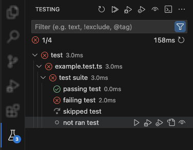
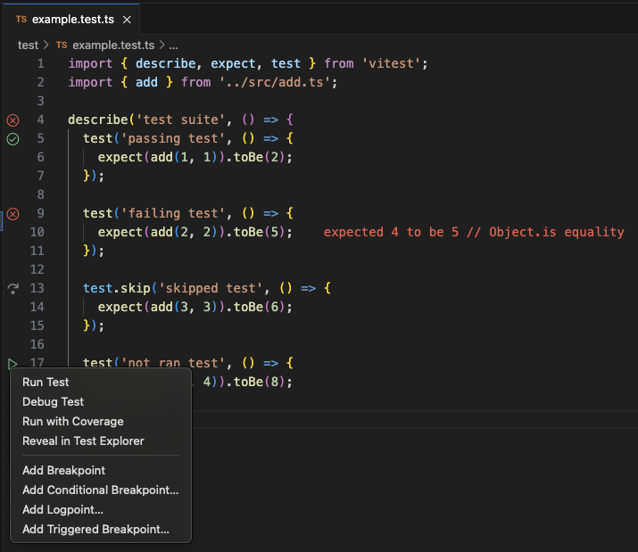

  

<h1 align="center">Vitest extension for Visual Studio Code. Available on <a href="https://marketplace.visualstudio.com/items?itemName=vitest.explorer">Visual Studio Marketplace</a>.</h1>

## Usage

You can manage tests both from the Testing view and directly within your test files.

### In the Testing View

You can access the extension from the Testing view **(1)**.

The toolbar **(2)** provides various commands to manage test execution:

- **Refresh Tests**: To reload your test suite, reflecting any new changes.
- **Run All Tests**: To start testing all cases that are currently visible.
- **Debug Tests**: To begin a debugging session for the tests.
- **Continuous Run/Stop Continuous Run**: To toggle the watch mode for running tests on file changes.
- **Show Output**: To display detailed logs from test executions.
- **Miscellaneous Settings**: To customize the Testing view, such as sorting and grouping tests.

The filter bar at the top of the Testing view allows you to narrow down the tests displayed, focusing on specific tests by name, exclusion patterns, or tags.

Icons next to each test indicate their status—passed (checkmark), failed (cross), skipped (arrow), or not executed (dot).

### In the Test File

When viewing a test file, you'll notice test icons in the gutter next to each test case:

- **Run a Single Test:** Click the test icon next to a test case to run that specific test.
- **More Options:** Right-click the test icon to open a context menu with additional options:
  - `Run Test`: Execute the selected test case.
  - `Debug Test`: Start a debugging session for the selected test case.
  - `Reveal in Test Explorer`: Locate and highlight the test in the centralized Testing view.
  - `Breakpoint Settings`: Set breakpoints to pause execution during debugging. You can add a standard breakpoint, a conditional breakpoint, a logpoint, or a triggered breakpoint.

## Features

- **Run**, **debug**, and **watch** Vitest tests in Visual Studio Code.
- **Coverage** support (requires VS Code >= 1.88)
- NX support (see the [NX sample](./samples/monorepo-nx/)).
- An `@open` tag can be used when filtering tests, to only show the tests open in the editor.

## Requirements

- Visual Studio Code version >= 1.77.0.
- Vitest version >= v1.4.0

## Configuration

You can identify if your config is loaded by the extension with `process.env.VITEST_VSCODE` and change the configuration accordingly.

- `vitest.rootConfig`: The path to your root config file. If you have several Vitest configs, consider using a [Vitest workspace](https://vitest.dev/guide/workspace).
- `vitest.workspaceConfig`: The path to the [Vitest workspace](https://vitest.dev/guide/workspace) config file. You can only have a single workspace config per VSCode workspace.
- `vitest.configSearchPatternExclude`: [Glob pattern](https://code.visualstudio.com/docs/editor/glob-patterns) that should be ignored when this extension looks for config files. Note that this is applied to _config_ files, not test files inside configs. Default: `**/{node_modules,.*}/**`
- `vitest.packagePath`: The path to a `package.json` file of a Vitest executable (it's usually inside `node_modules`) in case the extension cannot find it. It will be used to resolve Vitest API paths. This should be used as a last resort fix. If the extension cannot find Vitest, please open an issue.
- `vitest.nodeExecutable`: This extension spawns another process and will use this value as `execPath` argument.
- `vitest.nodeEnv`: Environment passed to the runner process in addition to
  `process.env`
- `vitest.debugExclude`: Excludes files matching specified glob patterns from debugging. Default:
  `[\"<node_internals>/**\", \"**/node_modules/**\"]`

## FAQs (Frequently Asked Questions)

### How can I use it in monorepo?

See <https://vitest.dev/guide/workspace.html> for monorepo support.

### Why is the extension not activated?

The extension looks for [Vitest config](https://vitest.dev/config/file.html) or [Vitest workspace config](https://vitest.dev/guide/workspace.html) to establish the connection with Vitest. If you have several config files, it's recommended to combine them in a single [Vitest workspace](https://vitest.dev/guide/workspace.html) for a better CPU performance (only have a single Vitest instance instead of several).
